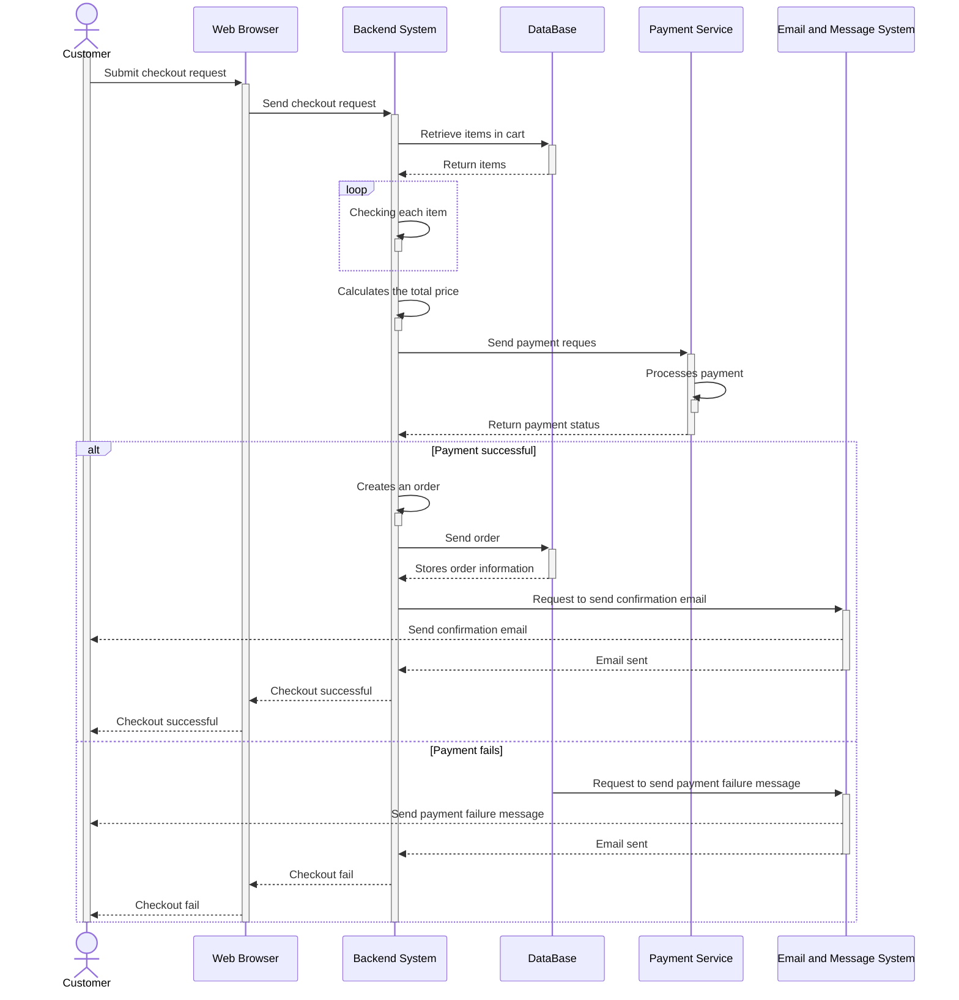

```mermaid
%% Remove the given template below
%% Write your mermaid code here:
sequenceDiagram
    actor c as Customer
    participant wb as Web Browser
    participant bs as Backend System
    participant db as DataBase
    participant ps as Payment Service
    participant es as Email and Message System 

    activate c
    c->>+wb: Submit checkout request

    wb->>+bs: Send checkout request

    bs->>+db: Retrieve items in cart
    db-->>-bs: Return items

    loop
    bs->>+bs: Checking each item
    deactivate bs
    end

    bs->>+bs: Calculates the total price
    deactivate bs

    bs->>+ps: Send payment reques

    ps->>+ps: Processes payment
    deactivate ps

    ps-->>-bs: Return payment status

    alt Payment successful
        bs->>+bs: Creates an order
        deactivate bs

        bs->>+db: Send order
        db-->>-bs: Stores order information

        bs->>+es: Request to send confirmation email
        es-->>c: Send confirmation email
        es-->>-bs: Email sent

        bs-->>wb: Checkout successful

        wb-->>c: Checkout successful
    else Payment fails
        db->>+es: Request to send payment failure message
        es-->>c: Send payment failure message
        es-->>-bs: Email sent

        bs-->>wb: Checkout fail

        wb-->>c: Checkout fail
    end

    deactivate bs
    deactivate wb
    deactivate c
```
